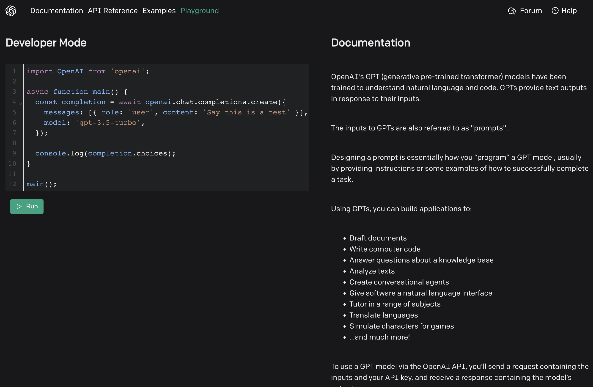

# Try Now Docs

This allows folks to proxy API requests and speed up onboarding via the docs.

## Get Started

`npm install`

## Dev

View on localhost:5000 `npm run dev`

## Build

`npm run build`
