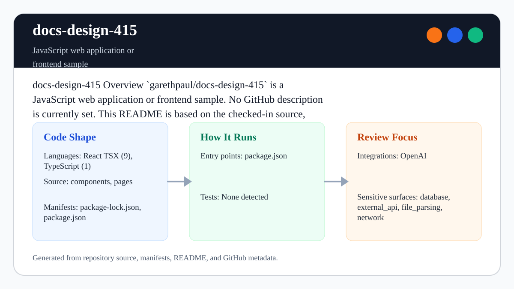

# docs-design-415

<!-- README-OVERVIEW-IMAGE -->


## Overview

`garethpaul/docs-design-415` is a JavaScript web application or frontend sample. The checked-in files describe a JavaScript web application or frontend sample with the structure summarized below.

This README is based on the checked-in source, manifests, scripts, and repository metadata on the `docs-page` branch. The project language mix found during review was: React TSX (9), TypeScript (1).

## Repository Contents

- `README.md` - project overview and local usage notes
- `package.json` - JavaScript dependency and script metadata
- `components` - source or example code
- `package-lock.json` - JavaScript dependency and script metadata
- `pages` - source or example code
- `SECURITY.md` - security reporting and disclosure guidance
- `Makefile` - repository-level verification wrapper
- `VISION.md` - project direction and maintenance guardrails

Additional scan context:

- Source directories: components, pages
- Dependency and build manifests: package-lock.json, package.json
- Entry points or build surfaces: package.json, Makefile
- Test-looking files: no obvious test files detected

## Getting Started

### Prerequisites

- Git
- Node.js 20.9 or newer and npm

### Setup

```bash
git clone https://github.com/garethpaul/docs-design-415.git
cd docs-design-415
npm ci
export OPENAI_API_KEY=sk-...
# Explicitly enable the spend-capable execute route for local testing.
export DOCS_EXECUTE_ENABLED=true
# Optional: comma-separated allow-list for proxied chat models.
export OPENAI_ALLOWED_MODELS=gpt-4o-mini,gpt-3.5-turbo
```

The setup commands above are derived from repository files. Legacy mobile, Python, or JavaScript samples may require older SDKs or package versions than a modern workstation uses by default.

## Running or Using the Project

- Run `npm run dev` for the local development server.
- Run `npm run build` before using `npm start` for the production server.

Detected npm scripts:

- `npm run audit` - `npm audit --audit-level=moderate`
- `npm run build` - `node node_modules/next/dist/bin/next build --webpack`
- `npm run check` - `scripts/check-baseline.sh`
- `npm run dev` - `node node_modules/next/dist/bin/next dev`
- `npm run start` - `node node_modules/next/dist/bin/next start`
- `npm run test` - `npm run type-check && npm run test:parser && npm run build && npm run check && npm run audit`
- `npm run test:parser` - `node node_modules/tsx/dist/cli.mjs scripts/test-execute-parser.ts`
- `npm run type-check` - `node node_modules/typescript/bin/tsc --noEmit`

## Testing and Verification

Run the local verification gate before changing the editor, docs route, or
execute API:

```bash
make check
make lint
npm test
```

`make check` delegates to `npm test`, which runs TypeScript checks, the Next
build, parser/validator regression tests through the source baseline guard,
and `npm audit --audit-level=moderate`. The execute API remains disabled unless
`DOCS_EXECUTE_ENABLED=true` and requires `OPENAI_API_KEY` at runtime. It accepts
`Content-Type: application/json` requests only, rejects multi-value Content-Type
headers, and validates submitted examples before calling the OpenAI SDK.
Request bodies may only contain a `code` string. It rejects whitespace-only message content so
blank prompts are not proxied. Chat message objects may only contain `role` and
`content`. Enabled provider calls use a fixed 30-second timeout with zero SDK
retries so one interactive request has a bounded OpenAI attempt. Enabled
traffic is limited to ten enabled POST attempts per process per minute;
exhausted windows return `429` with `Retry-After` before parsing or provider
setup. Public multi-instance deployments still require a shared limiter. The build
script clears the ignored .next directory before invoking
the Webpack-backed Next build so repeated local checks do not reuse stale traces.
Every execute API response sets `Cache-Control: no-store` so submitted code,
provider output, and route errors are not intentionally retained by shared or
browser caches.
GitHub Actions runs clean `npm ci` installs and `make check` on Node 20, 22,
and 24 on Ubuntu 24.04 for pushes, pull requests, and manual dispatches. The workflow pins its
third-party actions, grants read-only repository access, and bounds each job to
15 minutes. It does not persist checkout credentials in the job workspace.
The lockfile retains `esbuild 0.28.1` for the `tsx` parser test runner so the
moderate-severity audit gate rejects the vulnerable 0.28.0 resolution.

The `/docs` workspace retains its 250-pixel navigation rail and split intro/editor
layout on desktop. At 900 pixels and below, the sidebar becomes a bounded
full-width region and the content stacks into one column. Top navigation remains
horizontally available, and links, search, CTA, and language controls expose
visible keyboard focus. Language icon controls include accessible labels.

When the required SDK or runtime is unavailable, use static checks and source review first, then verify on a machine that has the matching platform toolchain.

## Configuration and Secrets

- Detected references to OpenAI. Keep API keys, OAuth credentials, tokens, and account-specific values in local configuration only.
- `OPENAI_API_KEY` must be provided through the environment. Do not commit
  OpenAI keys or sample outputs containing private prompt data.
- `DOCS_EXECUTE_ENABLED` must be exactly `true` after whitespace and case
  normalization before the spend-capable route is active. This is a deployment
  safety interlock, not authentication; public deployments still require an
  upstream authentication and rate-limiting layer.
- `OPENAI_ALLOWED_MODELS` can narrow the comma-separated chat model allow-list.
  It can only narrow the checked-in default model allow-list; unsupported
  values are not allowed to expand the proxy. When unset, the execute API only
  accepts the checked-in defaults.
- Submitted chat messages are normalized to `role` and `content` only; message
  metadata fields are rejected instead of silently dropped.
- Execute API request bodies are limited to the `code` field; extra fields such
  as credentials or metadata are rejected before code parsing.
- Extracted parameter and message objects preserve prototype-pollution keys as
  own fields so the allow-lists reject them.
- Numeric execute parameters must be finite numbers within their checked range;
  non-finite values are rejected before proxying.
- Execute normalization requires own request, parameter, and message fields
  before reading `code`, `model`, `messages`, `role`, or `content`.
- Enabled provider calls use a fixed 30-second timeout with zero SDK retries so
  one interactive request has a bounded OpenAI attempt.
- Provider-eligible requests consume the process-local budget only after
  Content-Type, body, code, parameter, and API-key validation. Ten eligible
  attempts per process per minute are admitted; excess eligible attempts receive
  `429` with `Retry-After` before provider setup. Multi-instance deployments
  still require shared upstream enforcement.
- Execute API responses use `Cache-Control: no-store` so code, model output,
  and errors are not intentionally cached.
- Execute content-type validation rejects multi-value Content-Type headers to
  avoid ambiguous request interpretation before body normalization.
- The parser test toolchain retains patched `esbuild 0.28.1` in the lockfile.

## Security and Privacy Notes

- Review changes touching external API calls or credential-adjacent configuration; examples from the scan include components/Editor.tsx, package.json, pages/api/execute/code.ts, pages/docs.tsx, and 1 more.
- Review changes touching network requests, sockets, or service endpoints; examples from the scan include components/Editor.tsx, components/Navigation.tsx, pages/docs.tsx, pages/index.tsx.
- Review changes touching file, media, JSON, XML, CSV, OCR, or data parsing; examples from the scan include components/Editor.tsx, components/Navigation.module.css, components/Sidebar.tsx, pages/api/execute/code.ts.
- Review changes touching database, model, or persistence code; examples from the scan include components/Editor.tsx.

## Maintenance Notes

- See `SECURITY.md` for vulnerability reporting and safe research guidance.
- See `VISION.md` for project direction and contribution guardrails.
- See `docs/plans/2026-06-08-docs-design-execute-api-baseline.md` for the
  current execute API hardening baseline.
- See `docs/plans/2026-06-09-docs-design-whitespace-message-guard.md` for the
  whitespace-only message content guard.
- See `docs/plans/2026-06-09-docs-design-model-allowlist-narrowing.md` for
  model allow-list narrowing semantics.
- See `docs/plans/2026-06-09-docs-design-clean-next-build.md` for repeatable
  Webpack build cache cleanup.
- See `docs/plans/2026-06-09-docs-design-json-content-type-guard.md` for the
  execute API JSON request boundary.
- See `docs/plans/2026-06-09-docs-design-message-field-allowlist.md` for the
  execute API message field allow-list.
- See `docs/plans/2026-06-09-docs-design-body-field-allowlist.md` for the
  execute API body field allow-list.
- See `docs/plans/2026-06-09-docs-design-prototype-key-rejection.md` for
  prototype key rejection in extracted execute API objects.
- See `docs/plans/2026-06-09-docs-design-finite-numeric-parameter-validation.md`
  for finite numeric execute parameters.
- See `docs/plans/2026-06-09-docs-design-own-field-validation.md` for own
  request, parameter, and message field validation.
- See `docs/plans/2026-06-10-ci-baseline.md` for the hosted GitHub Actions
  baseline.
- See `docs/plans/2026-06-12-responsive-docs-workspace.md` for responsive docs
  layout and keyboard-focus coverage.
- See `docs/plans/2026-06-10-docs-design-execute-enable-gate.md` for the
  explicit execute-route deployment interlock.
- See `docs/plans/2026-06-13-docs-design-openai-request-timeout.md` for the
  bounded provider-call contract.
- See `docs/plans/2026-06-13-docs-design-execute-fixed-window-budget.md` for the
  process-local execute request budget.
- See `docs/plans/2026-06-13-docs-design-provider-eligible-budget.md` for local
  validation ordering before execute capacity consumption.
- See `docs/plans/2026-06-14-docs-design-execute-no-store.md` for the execute
  response cache boundary.
- Use [`INTEGRATION_VERIFICATION.md`](INTEGRATION_VERIFICATION.md) for
  exact-head responsive browser, deployed route, deployment edge, and provider
  evidence. It requires isolated synthetic requests and sanitized outcomes.

## Contributing

Keep changes small and tied to the project that is already present in this repository. For code changes, document the toolchain used, avoid committing generated dependency directories or local configuration, and update this README when setup or verification steps change.
